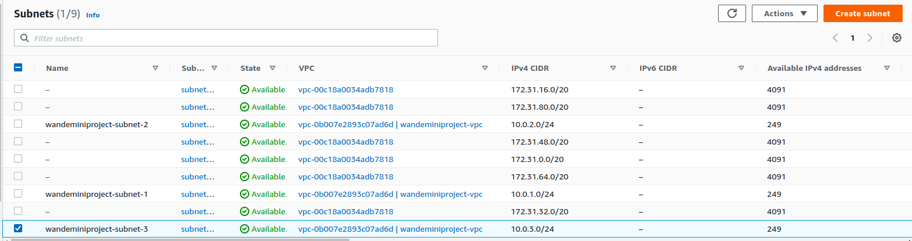
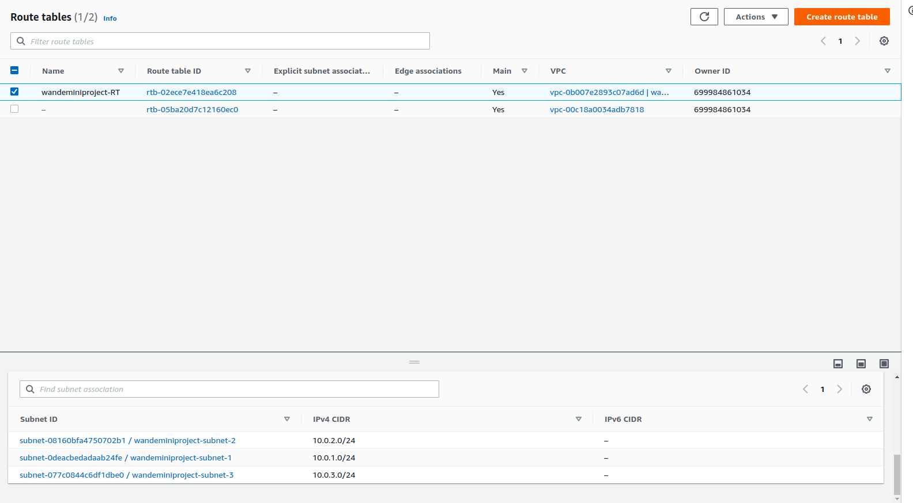
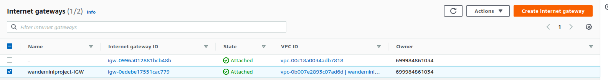
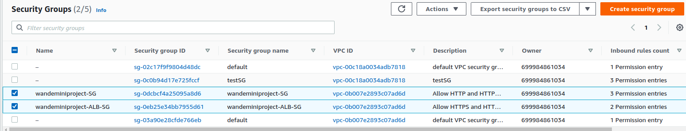
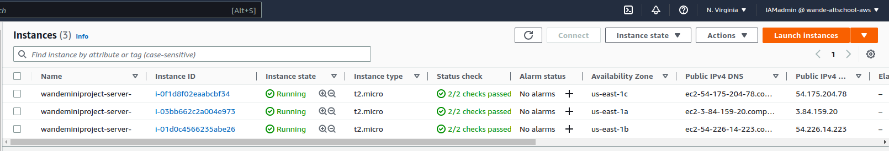
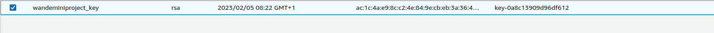
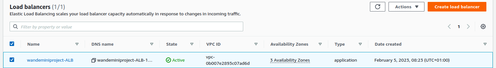

## AWS Deployment Automation Using Terraform and Ansible

## Scenario:
You're tasked to deploy webpages in multiple EC2 instances and attach to a Load Balancer all set up using Terraform. Ansible would handle the instances configurations by working with the output from terraform. Visiting `terraform-test.yourdomain.me` should display all instances webpages.

## Essentials:
* An AWS Account.
* A linux/mac system or instance or virtual machine or droplets
* Be logged in an IAM user with Admin priviledges 
* A custom domain name (sub-domain would be mapped)

## Procedures:
`I am currently writing a well detailed article with all research I did on this, note this [link](https://dev.to/wandexdev)when it drops`

## Screenshots:
* Network:
	* VPC

	* SUBNETS

	* Custom-DEFAULT ROUTE TABLES

	* INTERNET GATEWAY (IGW)

	* SECURITY GROUPS (Instances and ALB)

	 
* Servers: 
	* Instances

	* KEY PAIR

	* APPLICATION LOAD BALANCERS (ALB)

## Final Output:
Instance 1
