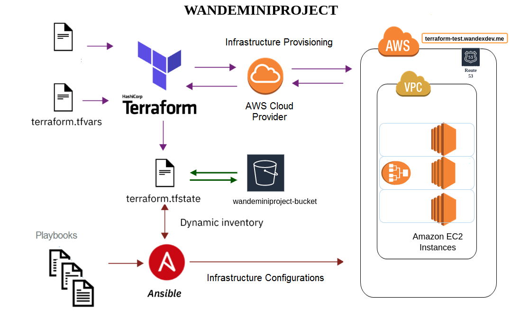

## AWS Deployment Automation Using Terraform and Ansible

## SCENERIO:
You're tasked to deploy webpages in multiple EC2 instances and attach to a Load Balancer all set up using Terraform. Ansible would handle the instances configurations by working with the output from terraform. Visiting `terraform-test.yourdomain.me` should display all instances webpages.

## ESSENTIALS: 
