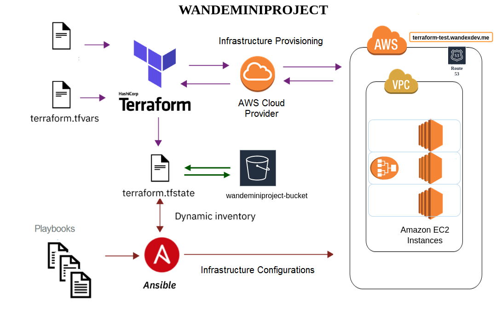
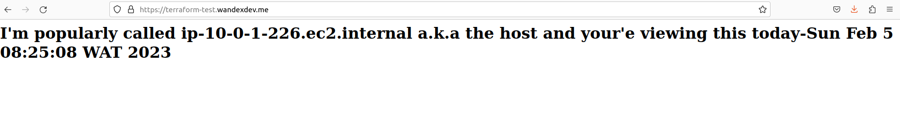
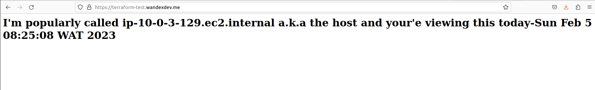
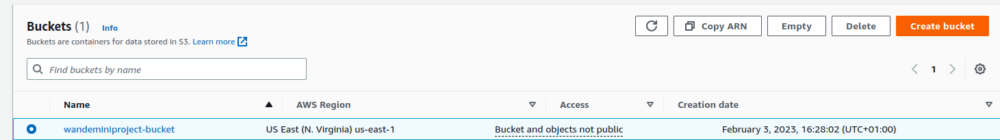
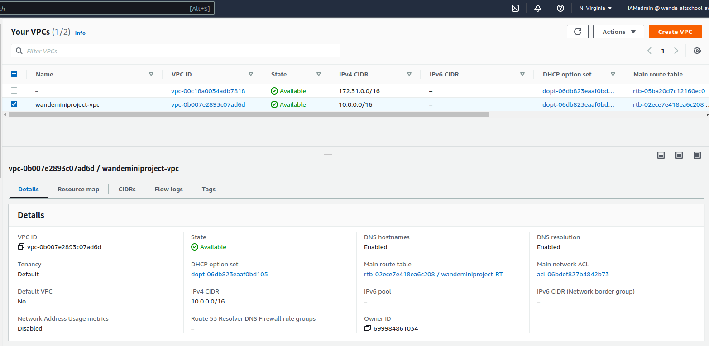

## AWS Deployment Automation Using Terraform and Ansible

## Scenario:
You're tasked to deploy webpages in multiple EC2 instances and attach to a Load Balancer all set up using Terraform. Ansible would handle the instances configurations by working with the output from terraform. Terraform should also link the load balncer's domain to a sub-domain called _terraform-test.yourdomain.com_ of your custom domain name, request and validate an ssl certifcate. 
Visiting `terraform-test.yourdomain.me` should display all instances webpages.

## Essentials:
* An AWS Account.
* A linux/mac system or instance or virtual machine or droplets
* Be logged in an IAM user with Admin priviledges 
* A custom domain name (sub-domain would be mapped)
* An S3 bucket to store the terraform state files remotely

## Procedures:
I am currently writing a well detailed article with all research I did on this, note this [link](https://dev.to/wandexdev) when it drops. Here is a summary of the steps.
 
- Install latest Terraform on the command line
- Install latest Ansible on th ecommand line
- Create a terraform folder (working directory), `cd` into it and `code` to open vs code
- Install the terraform extension by _Anton Kulikov_
- Install AWS CLI and Configure with `aws configure`
	- fill up outputs with credentials previously created from IAM user
	- add preferred region 
	- Test configuration details with `aws configure list`
	- No need to create environment variables as `env | grep AWS` will not recognize the enviroment variables set in another terminal tab hence `aws configure` is appropriate for global setup.
- Create a **variables.tf** file to declare variables used in this project and a **terraform.tfvars** file to input the variable values.
- Create a **s3_backend.tf** file to store remote state files as this ensures multiples users or CI server gets the latest state data before running terraform. Its also more secure. Fill up  

## Final Output: visit secured [terraform-test.wandexdev.me](terraform-test.wandexdev.me)
Instance 1

Instance 2

instance 3

## Screenshots:
* Remote Backend:

* Network:
	* VPC

	* SUBNETS

	* Custom-DEFAULT ROUTE TABLES

	* INTERNET GATEWAY (IGW)

	* SECURITY GROUPS (Instances and ALB)

	 
* Servers: 
	* Instances

	* KEY PAIR

	* APPLICATION LOAD BALANCERS (ALB)

